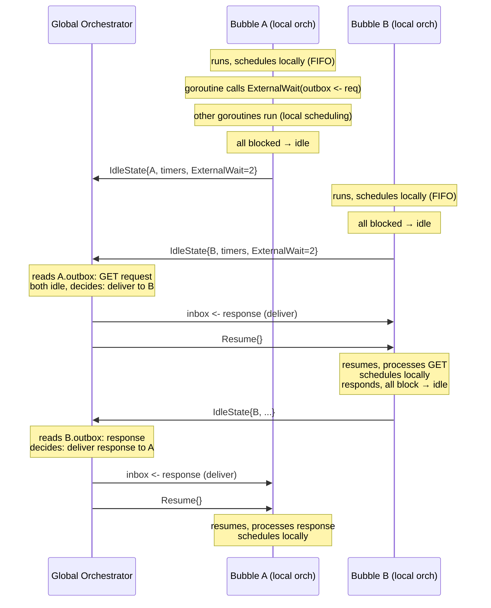

# Distributed Orchestrator Model

## How It Works

Each node is a synctest bubble. Each bubble has a local orchestrator
(`distributed.Bubble`) that handles scheduling internally. The global
orchestrator only gets involved when a bubble goes **idle** — when it
has nothing left to do on its own.

### The Cycle

```
1. Bubble runs. Goroutines execute, block, wake, schedule.
   Local orchestrator handles all scheduling (FIFO or prefix replay).

2. All goroutines block. Bubble goes idle.
   (ExternalWait > 0 — bridge goroutines waiting on transport channels)
   (Timers may be pending)

3. Idle hook fires. Local orchestrator sends IdleState to global:
     - BubbleState (Now, NextTimer, ExternalWait, Blocked, etc.)
     - Node name

4. Global orchestrator collects idle states from ALL bubbles.
   Global reads pending outbound messages from transport channels.
   Global decides:
     a) Deliver a network message → writes to target's inbox channel
     b) Advance time → sends Resume{AdvanceTimeTo: t}
     c) Nothing left → test is done

5. Global sends Resume to the target bubble.
   - If it delivered a message: the message wakes a goroutine in
     ExternalWait. The bubble automatically resumes.
   - If it advanced time: the bubble fires timers. If a timer wakes
     a goroutine, the bubble resumes.

6. Back to step 1. The local orchestrator handles scheduling.
   Eventually the bubble goes idle again. Back to step 3.
```

### What Goes Where

| Concern | Who handles it |
|---|---|
| Scheduling (which goroutine runs next) | **Local** orchestrator (FIFO / prefix / custom) |
| Time advancement (when to advance, to what value) | **Global** orchestrator (via `Resume.AdvanceTimeTo`) |
| Network delivery (which message to deliver when) | **Global** orchestrator (writes to transport channel) |
| Intra-bubble replay (same scheduling decisions) | **Local** orchestrator (via `WithPrefix`) |
| Inter-bubble replay (same delivery order) | **Global** orchestrator (follows recorded global trace) |

---

## The `distributed` Package

### Types

```go
type Bubble struct {
    Name   string
    Idle   <-chan IdleState  // read by global orchestrator
    Resume chan<- Resume     // written by global orchestrator
}

type IdleState struct {
    Name  string
    State BubbleState  // Now, NextTimer, ExternalWait, External, Blocked, etc.
}

type Resume struct {
    AdvanceTimeTo int64  // >0 = advance clock; 0 = message was delivered
}
```

### Creating a Bubble

```go
// Outside the bubble (global orchestrator):
b := distributed.NewBubble("node1")

// With scheduling prefix for replay:
b := distributed.NewBubble("node1", distributed.WithPrefix(savedTrace))

// With custom scheduler:
b := distributed.NewBubble("node1", distributed.WithScheduler(mySchedulerFn))
```

### Wiring the Hook

```go
// Inside the bubble (test function):
synctest.SetDecisionHook(b.Hook())
```

That's it. The hook handles everything:
- Scheduling decisions → resolved locally, never leaves the bubble
- Idle → sends `IdleState` on `b.Idle`, waits for `Resume` on `b.Resume`

---

## Building the Transport

The transport is your code. Use `ExternalWait` to cross the bubble boundary.
Create channels outside the bubble, pass them in.

```go
// Global orchestrator creates these (outside bubbles):
type NodeChannels struct {
    Outbox chan Request    // unbuffered: node blocks until orch reads
    Inbox  chan Response   // buffered 1: orch can pre-load before resuming
}

// Inside the bubble, the node does RPCs like this:
func nodeGet(ch NodeChannels, key string) string {
    // Phase 1: send request to orchestrator
    synctest.ExternalWait(func() {
        ch.Outbox <- Request{Method: "GET", Key: key}
    })
    // ← scheduling hook fires here (interleaving point)
    // ← other goroutines in this node can run

    // Phase 2: wait for response
    var val string
    synctest.ExternalWait(func() {
        resp := <-ch.Inbox
        val = resp.Value
    })
    return val
}
```

For raft, implement the `Transport` interface:

```go
type RaftTransport struct {
    outbox chan<- Message
    rpcCh  chan raft.RPC  // bubble channel — raft reads via Consumer()
}

func (t *RaftTransport) Consumer() <-chan raft.RPC { return t.rpcCh }

func (t *RaftTransport) AppendEntries(id raft.ServerID, target raft.ServerAddress,
    args *raft.AppendEntriesRequest, resp *raft.AppendEntriesResponse) error {
    // Send request, wait for response — same two-phase ExternalWait pattern
    synctest.ExternalWait(func() { t.outbox <- Message{To: target, Payload: args} })
    var reply Message
    synctest.ExternalWait(func() { reply = <-t.responseBox })
    *resp = *reply.Payload.(*raft.AppendEntriesResponse)
    return nil
}

// Bridge goroutine for inbound RPCs (started inside bubble):
go func() {
    for {
        var msg Message
        synctest.ExternalWait(func() { msg = <-inbox })
        respCh := make(chan raft.RPCResponse, 1)
        t.rpcCh <- raft.RPC{Command: msg.Payload, RespChan: respCh}
        go func(id uint64) {
            r := <-respCh
            synctest.ExternalWait(func() { t.outbox <- Message{ReplyID: id, Payload: r.Response} })
        }(msg.ID)
    }
}()
```

---

## Building the Global Orchestrator

### Record

```go
b1 := distributed.NewBubble("A")
b2 := distributed.NewBubble("B")
chA := NewNodeChannels()  // outbox + inbox for node A
chB := NewNodeChannels()  // outbox + inbox for node B
store := NewStore()

// Spawn bubbles
go synctest.Test(t, func(t *testing.T) {
    synctest.SetDecisionHook(b1.Hook())
    IncrementCounter(chA)
})
go synctest.Test(t, func(t *testing.T) {
    synctest.SetDecisionHook(b2.Hook())
    IncrementCounter(chB)
})

// Orchestrator: drain A then B (sequential)
var globalTrace []GlobalEvent

// A does GET, SET
globalTrace = append(globalTrace, serviceRequest("A", chA, store))
globalTrace = append(globalTrace, serviceRequest("A", chA, store))
// B does GET, SET
globalTrace = append(globalTrace, serviceRequest("B", chB, store))
globalTrace = append(globalTrace, serviceRequest("B", chB, store))
// Result: counter="2" (correct, no race)
```

### Replay

```go
// Same setup. Follow the recorded trace:
for _, ev := range globalTrace {
    ch := channelsByName(ev.Node)
    serviceFromTrace(ch, store, ev)
}
// Same result: counter="2"
```

### Explore (find bugs)

```go
// Interleave the trace:
modified := interleave(globalTrace)
// Original: A-GET, A-SET, B-GET, B-SET
// Modified: A-GET, B-GET, A-SET, B-SET

// Replay with interleaved order:
for _, ev := range modified {
    ch := channelsByName(ev.Node)
    serviceFromTrace(ch, store, ev)
}
// Result: counter="1" — both read "", both write "1". Lost update bug!
```

### With Timers

When all bubbles are idle and there are no pending messages:

```go
for {
    // Collect idle states
    idle1 := <-b1.Idle
    idle2 := <-b2.Idle

    // Check for pending messages (non-blocking read from outboxes)
    // ... drain outboxes into pending queue ...

    if len(pending) > 0 {
        // Deliver a message
        msg := pending[0]
        target := inboxByName(msg.To)
        target <- msg.Response               // deliver FIRST
        bubbleByName(msg.To).Resume <- Resume{}  // then resume
    } else {
        // No messages. Advance time to earliest timer.
        earliest := min(idle1.State.NextTimer, idle2.State.NextTimer)
        if earliest == 0 {
            break // done
        }
        // Advance ALL bubbles to the same time
        b1.Resume <- Resume{AdvanceTimeTo: earliest}
        b2.Resume <- Resume{AdvanceTimeTo: earliest}
    }
}
```

---

## Contracts

**Local handles scheduling.** The hook resolves non-idle decisions
internally. The global orchestrator never sees scheduling events.

**Global only sees idle.** The `Idle` channel fires when the bubble
has exhausted all local work. `IdleState.State` contains everything
the global orchestrator needs: timers, ExternalWait count, clock.

**Deliver before resume.** When delivering a message, write to the
transport channel BEFORE sending `Resume`. The goroutine wakes while
`rootInHook = true`. When the hook returns, `findRunnable` picks it up.

**Timer ownership.** When `ExternalWait > 0` and a hook is set, the
bubble does NOT auto-advance time. Time only advances when the global
orchestrator sends `Resume{AdvanceTimeTo: t}`.

**Non-bubble hook channels.** `Idle`/`Resume` channels are created
outside the bubble. Root blocking on them does NOT decrement `running`.
No bounce loop.

**One bubble active at a time.** Only the bubble that received a `Resume`
is active. All others are frozen in their hooks. This guarantees global
determinism — no OS thread scheduling non-determinism between bubbles.

---

## Sequence Diagram


