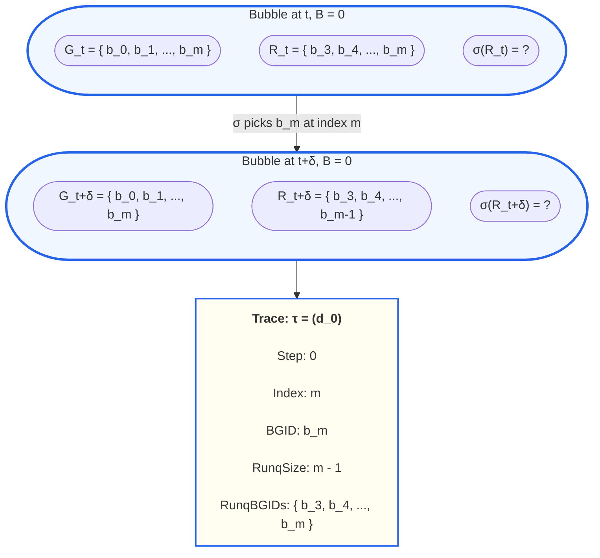

# Synctest Bubble: Formal Model

## 1. Bubble (Local Model)

### Definition 1.1: Goroutine

A **goroutine** is a sequential thread of execution within a Go program.
Each goroutine in a bubble is assigned a **bubble-local goroutine ID** (BGID),
a monotonically increasing integer assigned at creation time. The root
goroutine of a bubble has BGID 0.

### Definition 1.2: Bubble State

A **bubble** is an isolated scheduling domain. Each bubble is assigned a
deterministic **bubble ID** at creation time. A bubble has a one-to-one
relationship with a P (processor) — the bubble owns exactly one P for
its lifetime, and that P only runs goroutines belonging to the bubble.

A bubble at time $t$ is described by:

- $G_t = \{b_0, b_1, \ldots, b_m\}$: the set of live goroutines, identified by their BGIDs
- $R_t \subseteq G_t$: the **runnable set** — goroutines eligible to execute, ordered by position in the runq
- $S_t$: the **shared state** — memory, channels, and synchronization state visible to goroutines in the bubble
- $\sigma$: the **scheduling function** that picks the next goroutine at each decision point

### Definition 1.3: Decision Point

A **decision point** occurs when `findRunnable` on the bubble's P must
choose the next goroutine to run. This happens when:

1. The currently running goroutine **blocks** (channel op, mutex, sleep, park)
2. The currently running goroutine **exits**
3. The bubble is first entered (initial pick from runq)

At a decision point, the scheduler observes $R_t$ and picks one $b_i \in R_t$.

### Definition 1.4: Scheduling Function

The **scheduling function** maps each decision point to a selection from
the runnable set. It can be expressed as an **index** into the ordered runq:
index 0 is the FIFO choice (runnext, then head of runq), index 1 is the
next, and so on.

The **default scheduling function** always returns index 0 (FIFO).

### Definition 1.5: Quantum

A **quantum** is the sequence of instructions executed by the chosen
goroutine from when it is scheduled until the next decision point
(it blocks, exits, or yields).

With `asyncpreemptoff=1` and a single P, a quantum extends from schedule
to the next voluntary yield. There is no mid-quantum preemption.

### Definition 1.6: Trace

A **trace** is the complete sequence of scheduling decisions in a bubble execution:

$$\tau = (d_0, d_1, \ldots, d_n)$$

Each decision $d_t$ records:
- **Step**: position in the sequence
- **Index**: the scheduling choice (which position in the runq)
- **ChosenBgid**: the BGID of the selected goroutine
- **RunqSize**: number of runnable goroutines
- **RunqBgids**: the ordered BGIDs of all runnable goroutines

This maps directly to the `synctest.Decision` struct in the implementation.

### Definition 1.7: Interleaving

An **interleaving** is a complete trace from bubble creation to quiescence
(all goroutines blocked or exited). Two interleavings are **distinct** if
they differ in at least one scheduling choice.

---

## 2. Guarantees

### Theorem 2.1: Determinism (Record-Replay)

Given a program and a recorded trace, replaying with the same scheduling
choices produces:

1. **Identical trace**: same BGIDs, runnable sets, and decisions at every step
2. **Identical shared state**: same final memory state
3. **Identical observable behavior**: same output, same side effects

*Preconditions*:
- `GODEBUG=asyncpreemptoff=1` (no async preemption)
- Single P per bubble (cooperative scheduling)
- No external nondeterminism (time, I/O) unless wrapped in `External()`
- Identical program across runs

### Theorem 2.2: BGID Stability

The BGID assigned to each goroutine is deterministic and depends only on
creation order, which is determined by the trace prefix up to the
goroutine's creation point.

If two traces agree on the first $k$ decisions, any goroutine created
during those $k$ quanta receives the same BGID in both executions.

---

## 3. Yield Points

A **yield point** is a program location where the current goroutine may
cease executing, creating a decision point.

| Yield point | Mechanism |
|---|---|
| Channel send (blocking) | Goroutine parks on channel wait queue |
| Channel receive (blocking) | Goroutine parks on channel wait queue |
| Mutex.Lock (contended) | Goroutine parks on semaphore |
| WaitGroup.Wait | Goroutine parks on semaphore |
| Goroutine exit | Goroutine removed from live set |
| `runtime.Gosched()` | Voluntary yield |

These are **goroutine-level** yield points: decisions happen when a
goroutine blocks or exits, not at individual memory accesses.

**Future work**: More yield points need to be added, such as memory
access to shared variables, random yield points to mimic preemption,
and others informed by scheduling-based concurrency testing research.

---

## 4. External Operations

### External

`External(fn)` temporarily removes a goroutine from the bubble so it can
perform real I/O (network calls, disk, Redis, etc.) without blocking
bubble progress.

What happens:
1. The bubble's `running` counter is decremented and the goroutine is detached (`gp.bubble = nil`)
2. The goroutine executes `fn` outside the bubble — invisible to the scheduler
3. When `fn` returns, the goroutine reattaches to the bubble and `running` is restored

The bubble tracks detached goroutines via an `external` counter. While
`external > 0`, the bubble does not advance fake time or declare
quiescence, because an external operation may produce new work.

**Use case**: Any operation that would block forever inside a bubble
(real network I/O, database calls, cross-bubble channel operations).

### Quiescence

A bubble reaches **quiescence** when no goroutine can make progress:

- No goroutines are runnable (runq is empty)
- No goroutines are actively running (`running = 0`)
- No goroutines are executing externally (`external = 0`)

This is the "durably blocked" state. If any of these conditions is not
met, the bubble waits.
