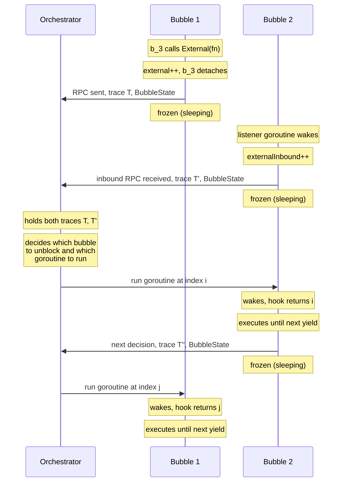

# Distributed Orchestrator Model

## Vision

The orchestrator is an external process that controls **every scheduling
decision across multiple bubbles**. It sees the full global state — every
bubble's trace, every in-flight RPC — and decides both **which bubble to
unblock** and **which goroutine to run** within that bubble.

Each bubble communicates with the orchestrator through its decision hook.
The hook is not a local closure that returns immediately — it **blocks**,
sending the bubble's trace and state to the orchestrator, and waits for
a reply. While waiting, the bubble is frozen.

## Flow

1. **Bubble 1** is running at time t. Goroutine b_3 calls `External(fn)`
to send an RPC to Bubble 2's node. `external++`, b_3 detaches and
sends the RPC.

2. Other goroutines in Bubble 1 continue until a **yield point**. The
decision hook fires. The hook sends Bubble 1's trace T and
BubbleState (including `external > 0`) to the orchestrator.
**Bubble 1 sleeps.**

3. The RPC arrives at **Bubble 2**. A listener goroutine that was parked
wakes up and enters the runq. `externalInbound++` marks that an
inbound RPC arrived.

4. At Bubble 2's next **decision point**, the hook fires. It sees
`externalInbound > 0` in its BubbleState. The hook sends Bubble 2's
trace T' to the orchestrator: "I received an inbound RPC, here's my
state." **Bubble 2 sleeps.**

5. The **orchestrator** now holds both traces (T from Bubble 1, T' from
Bubble 2). It has full visibility into every goroutine, every
in-flight RPC, every runnable set. It decides what happens next.

6. The orchestrator replies to one bubble with the **index** of the
goroutine to run. That bubble wakes, the hook returns the index,
execution continues until the next yield point — and the cycle
repeats.

## What the Orchestrator Sees

At any point, the orchestrator holds:

- **Per bubble**: trace (all past decisions), BubbleState (runnable set,
BGIDs, external count, externalInbound count)
- **Global**: which bubbles are frozen, which RPCs are in flight,
the complete cross-bubble message graph

This gives it enough information to:
- Replay a recorded global schedule exactly
- Explore alternative interleavings (DFS across bubbles)
- Detect bugs that require specific cross-bubble orderings (lost updates,
distributed deadlocks, etc.)

## What Exists vs What's Needed

| Exists | Needed |
|---|---|
| `external` counter (outbound detach) | `externalInbound` counter (inbound RPC arrived) |
| Hook signature `func(BubbleState) int32` | Hook that blocks (sends state to orchestrator, waits for reply) |
| Bubble sleep while `external > 0` | Bubble sleep while waiting for orchestrator reply at hook |
| `External(fn)` detach/reattach | Orchestrator protocol (gRPC or channel-based) |
| Channel-based plumbing (outbox/inbox) | Orchestrator that uses traces to make decisions |
| Auto-responder (always FIFO) | Orchestrator with DFS exploration across bubbles |
