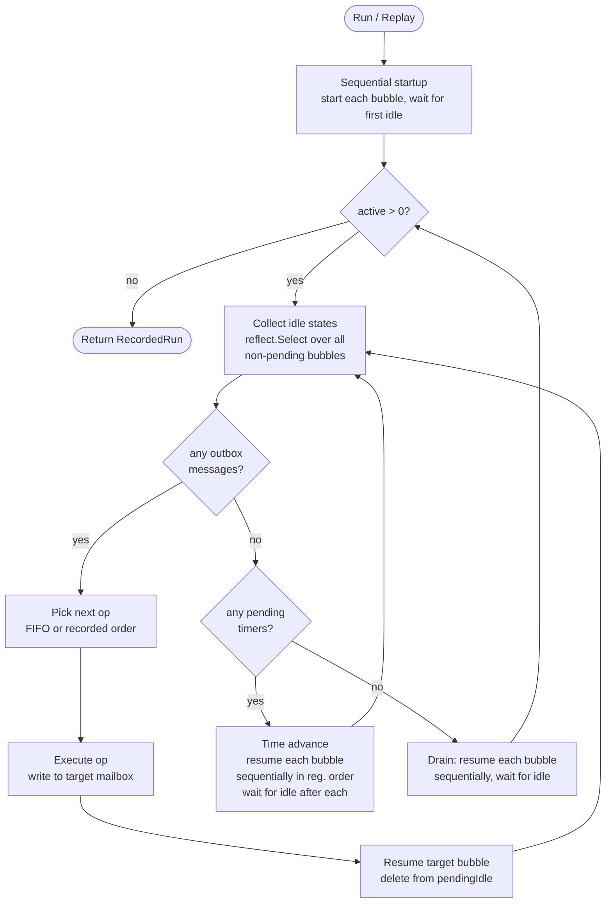
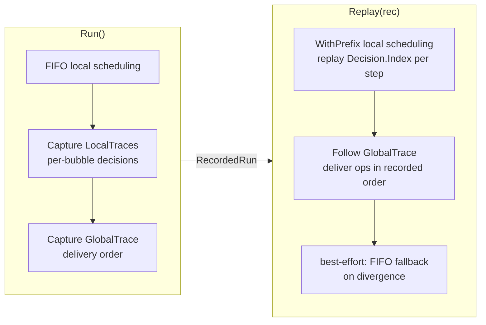

# `orchestrator` & `rafttest` — Design Report

## Overview

These two packages together provide a **fully deterministic harness for testing distributed Go systems** using `testing/synctest`. Each node runs in an isolated synctest bubble with fake time. The global orchestrator serializes all cross-node interactions — message delivery and clock advancement — making every execution reproducible to the bit.

---

## `orchestrator` — Global Orchestrator

### Key types

| Type | Role |
|---|---|
| `Orchestrator` | Drives all bubbles; holds the schedulable queue and global trace |
| `nodeCtrl` | Per-node state: bubble handle, `done` channel, captured local trace |
| `PendingOp` | A pending cross-node message (`From`, `To`, `Type`, `Execute` closure) |
| `RecordedRun` | Snapshot of a complete run: `GlobalTrace []GlobalStep` + `LocalTraces map[string][]Decision` |
| `GlobalStep` | One orchestrator event: `StepDeliver`, `StepTimeAdvance`, or `StepDone` |

### Main loop



### Startup & idle protocol

Each node runs inside `synctest.Explore` (not `synctest.Test` — avoids `t.FailNow()` mid-goroutine). The bubble's `Hook()` drives the local scheduling; when the bubble goes idle it sends an `IdleState` and **freezes**, waiting for `Resume`. The orchestrator is the only entity that sends `Resume`.

### Record vs Replay



---

## `rafttest` — Raft Transport

`RaftTransport` implements `raft.Transport` by routing every RPC through the orchestrator's outbox/mailbox pipeline instead of a real network.

### Per-node channels

```
┌─────────────────────────────────────────────────────┐
│  Bubble (synctest)                                  │
│                                                     │
│  Raft goroutines ──► internalConsumer (chan RPC)    │
│        ▲                      │                     │
│        │ respCh (bubble chan) │ forwardResponse     │
│        │                     ▼                     │
│  Bridge goroutine ◄── mailbox (buffered 16)         │
│  [ExternalWait]                                     │
│        │                                            │
│        └──► outbox (buffered 64) ──► Orchestrator  │
└─────────────────────────────────────────────────────┘
```

### RPC request/response lifecycle

An RPC (e.g. `AppendEntries`) travels through two orchestrator-controlled hops: one for the request, one for the response. Both are mediated by `ExternalWait` so the sender's bubble can go idle between them.

**Sending the request (node1 → node2)**

1. A Raft goroutine on node1 calls `transport.AppendEntries(node2, args)`, which enters `makeRPC`.
2. `makeRPC` allocates a `reqID` and a buffered `respCh` channel (created inside the bubble so blocking on it is a durable block), then calls `synctest.ExternalWait` with a closure that sends a `PendingOp` to the outbox. Because the outbox is buffered (cap 64), the send typically completes without blocking and the goroutine exits `ExternalWait` immediately.
3. The goroutine then blocks on `resp := <-respCh` — a durable in-bubble receive. With node1's bridge goroutine simultaneously waiting in `ExternalWait` on the mailbox, all goroutines in node1's bubble are now blocked, so the bubble goes idle and signals the orchestrator.
4. The orchestrator drains node1's outbox, dequeuing the `PendingOp`. It calls `op.Execute()`, which writes an `envelope{request}` directly into node2's mailbox (buffered 16), then sends `Resume` to node2's bubble.

**Processing on node2**

5. node2's bridge goroutine wakes from its `ExternalWait` on the mailbox. It reads the envelope and forwards it onto `internalConsumer` — a bubble-internal channel that Raft's consumer loop reads from. A `forwardResponse` goroutine is also spawned to handle the reply path.
6. node2's Raft goroutine reads from `internalConsumer`, processes the request (e.g. appends the log entry), and writes the result to `proxyRespCh` (buffered 1, inside the bubble).
7. `forwardResponse` reads from `proxyRespCh`, then calls `synctest.ExternalWait` to send a new `PendingOp` (the response) to node2's outbox. All goroutines in node2 then go idle, signalling the orchestrator.

**Delivering the response (node2 → node1)**

8. The orchestrator drains node2's outbox, dequeues the response `PendingOp`, calls `Execute()` to write an `envelope{response}` into node1's mailbox, and sends `Resume` to node1's bubble.
9. node1's bridge goroutine wakes, reads the response envelope, looks up `reqID` in the `pending` map, and sends the `raft.RPCResponse` to `respCh`.
10. The `makeRPC` goroutine unblocks from `<-respCh`, copies the response fields, and returns to the Raft caller.

At no point do node1 and node2 run at the same time: each bubble is frozen in its hook while the other is active.

---

## Determinism guarantees

Three layers work together to make `record == replay` exact:

| Layer | Mechanism |
|---|---|
| **Local scheduling** | `distributed.WithPrefix` replays `Decision.Index` at each runq step — same goroutine order, same code paths |
| **Global delivery** | `Replay` matches ops by `{From, To, Type}` and delivers them in the recorded sequence |
| **Application randomness** | `rand.Seed(42)` + `randseednop=0`; all bubbles resume *sequentially* (never concurrently) during time advances, eliminating mutex-order races on `math/rand.globalRand` |

The sequential time-advance rule (bubble A finishes processing before bubble B gets its Resume) is the critical invariant: it ensures that every `rand.Int63()` call across all nodes happens in a fixed `node1 → node2 → node3` order in both runs.

### Why `rand.Seed` is necessary

Raft's election and heartbeat timers are not fixed intervals. Each call to `randomTimeout` adds a random jitter drawn from `math/rand.Int63()`:

```go
func randomTimeout(minVal time.Duration) <-chan time.Time {
    extra := time.Duration(rand.Int63()) % minVal
    return time.After(minVal + extra)
}
```

This jitter determines which node's election timer fires first, and therefore which node becomes the leader. If the jitter differs between the record run and the replay run, a different node wins the election, the message sequence changes, and the global trace no longer matches.

`WithPrefix` controls *goroutine scheduling order* within each bubble but has no influence over these application-level random values. The prefix ensures goroutines run in the same sequence; it does not ensure they produce the same timer durations.

**Why a fixed seed alone is not enough**

In Go 1.20+, `rand.Seed` became a no-op by default (`randseednop=1`). Calling it has no effect: the global source remains randomly seeded from the OS at program startup. Setting `GODEBUG=randseednop=0` (done in `TestMain` via `os.Setenv`) re-enables `rand.Seed` so it actually resets the global source.

Even with a working `rand.Seed(42)`, a second problem arises: the global rand source uses an internal mutex for thread safety. If multiple bubbles call `rand.Int63()` concurrently — which happens whenever the orchestrator resumes all idle bubbles simultaneously during a time advance — the order in which they acquire the mutex is determined by OS scheduling. That order is non-deterministic across runs even with an identical seed, so each bubble gets a different value from the same sequence.

For example, with `rand.Seed(42)` and a seeded sequence [v₁, v₂, v₃, ...]:

- **Record run**: node1 acquires the mutex first → gets v₁; node2 gets v₂; node3 gets v₃.
- **Replay run**: node3 acquires first → gets v₁; node1 gets v₂; node2 gets v₃.

Every node ends up with a different jitter value than it had in the record run, producing a different leader and a different global trace.

**The complete fix: sequential time advance**

The orchestrator resolves this by resuming bubbles one at a time during every time advance, in fixed registration order (`node1 → node2 → node3`), and waiting for each to go idle before resuming the next. Combined with the sequential startup (same ordering for initialization), this guarantees that every `rand.Int63()` call across the entire run is serialized in a fixed order in both record and replay. The seed then produces the same value for the same node at the same point in the sequence, making timer jitter — and therefore the full global trace — bit-for-bit identical.
