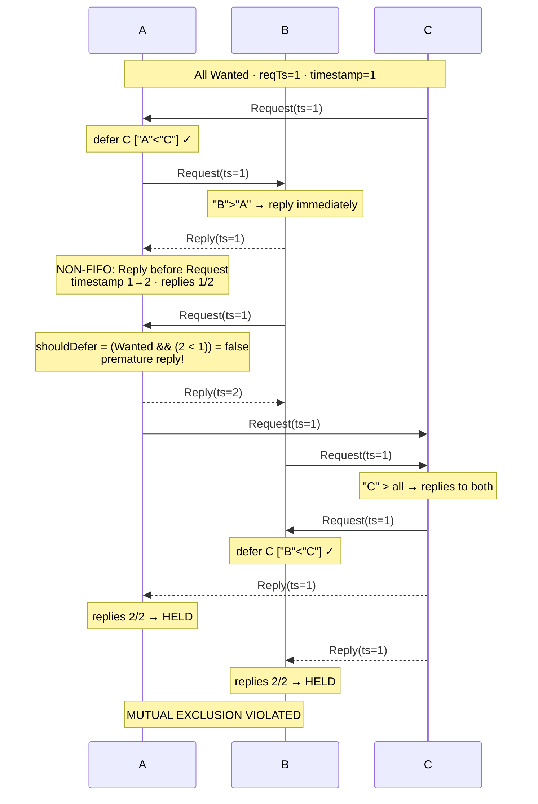

# RA Lock Mutation Testing

This document describes two injected bugs in the Ricart-Agrawala lock implementation
and the tests that demonstrate how the orchestrator's exploration finds them.

---

## Bug 1: Stale Clock in `shouldDefer` (FIFO-latent)

### Mutation (two changes to `lock.go`)

**Change 1 — move the Lamport clock update inside `MsgReply` only.**

In `handleMessage`, the clock update block currently sits at the top and fires for
every message kind. Move it so it only runs inside `case MsgReply:`:

```go
// ORIGINAL: clock updated for all message kinds
func (n *RANode) handleMessage(msg Message) {
    n.mu.Lock()
    if msg.Timestamp > n.timestamp { n.timestamp = msg.Timestamp }
    n.timestamp++
    switch msg.Kind {
    case MsgReply:
        ...
    case MsgRequest:
        ...
    }
}

// MUTATED: clock updated only on REPLYs
func (n *RANode) handleMessage(msg Message) {
    n.mu.Lock()
    switch msg.Kind {
    case MsgReply:
        if msg.Timestamp > n.timestamp { n.timestamp = msg.Timestamp }
        n.timestamp++
        ...
    case MsgRequest:
        ...    // n.timestamp NOT updated here
    }
}
```

**Change 2 — use `n.timestamp` instead of `n.reqTimestamp` in `shouldDefer`.**

```go
// ORIGINAL:
shouldDefer := n.state == Held ||
    (n.state == Wanted && (n.reqTimestamp < msg.Timestamp ||
        (n.reqTimestamp == msg.Timestamp && n.id < msg.From)))

// MUTATED:
shouldDefer := n.state == Held ||
    (n.state == Wanted && (n.timestamp < msg.Timestamp ||
        (n.timestamp == msg.Timestamp && n.id < msg.From)))
```

### Why It's a Bug

`reqTimestamp` is fixed at the moment the node sends its REQUEST. `n.timestamp`
only grows when **REPLY** messages are received (due to Change 1). If node B has
already received a REPLY from C (bumping `B.timestamp` to, say, 4) before
processing C's REQUEST (which carries `ts=1`), the comparison becomes `4 < 1 = false`.
B skips deferral and sends an immediate REPLY to C — even though B's own request
(with `reqTimestamp=1`) has equal priority to C's. C collects B's premature reply
plus A's deferred reply, enters the CS simultaneously with B, violating mutual
exclusion.

### Why It's Latent Under FIFO Delivery

Under FIFO, REPLYs are generated **in response to** REQUESTs, so they always appear
*later* in the delivery queue than the REQUESTs they respond to. When B processes
C's REQUEST under FIFO ordering, no REPLY has arrived yet — `n.timestamp` has never
been incremented (the clock update is now gated on `MsgReply`) — so
`n.timestamp == n.reqTimestamp` and the bug is invisible.

> **Why the naïve single-change mutation doesn't work**: replacing `n.reqTimestamp`
> with `n.timestamp` *without* moving the clock update fails to be FIFO-latent
> because `handleMessage` does `n.timestamp = max(...) + 1` for every message,
> making `n.timestamp > msg.Timestamp` always true — so `shouldDefer` is always
> false regardless of delivery order.

### Triggering Delivery Ordering

The key is delivering a REPLY to a node before a REQUEST from the same sender,
so the node's timestamp is bumped before the REQUEST is processed.

Actual trace found by Explore (run 7), with nodes A, B, C all having `reqTs=1`:

```
C → A : Request(ts=1)        A defers C  ["A" < "C"] ✓
A → B : Request(ts=1)        B replies immediately  ["B" > "A"]

        ⚡ NON-FIFO: B→A Reply delivered before B→A Request

B → A : Reply(ts=1)          A.timestamp: 1 → 2,  replies: 1/2,  still Wanted
B → A : Request(ts=1)        🐛 BUG: shouldDefer = (Wanted && (2 < 1)) = false
A → B : Reply(ts=2)          A prematurely replies to B

A → C : Request(ts=1)        C replies immediately  ["C" > "A"]
B → C : Request(ts=1)        C replies immediately  ["C" > "B"]
C → B : Request(ts=1)        B defers C  ["B" < "C"] ✓

A → B : Reply(ts=2)          B replies: 1/2  (A's premature reply arrives)
C → A : Reply(ts=1)          A replies: 2/2  →  A ENTERS HELD
C → B : Reply(ts=1)          B replies: 2/2  →  B ENTERS HELD  💥

        ⚠️  MUTUAL EXCLUSION VIOLATED: A and B both in CS
```



Under **FIFO**, B→A Request is delivered before B→A Reply (the Reply is generated
later, in response to A's request). When A processes B's Request, `A.timestamp=1 =
A.reqTimestamp` and `shouldDefer = (1 < 1) || (1==1 && "A"<"B") = true` — A
correctly defers. The bug is invisible.

This requires exactly **1 non-FIFO delivery choice** (B→A Reply before B→A Request).
`GlobalBound(2)` is sufficient. Three nodes are required because with two nodes a
REPLY from the only peer immediately transitions the node to Held, where the existing
`Held` guard handles the REQUEST correctly — the bug cannot fire.

Explore finds the violation in ~7 runs (~51 seconds on a 2024 MacBook Pro).

### Tests

| Test | Nodes | Expected |
|------|-------|----------|
| `TestStaleClockBug_FIFOPassesBugLatent` | 3 | `orch.Run` passes; `counter == 3` |
| `TestStaleClockBug_ExploreFindsViolation` | 3 | FAIL with "mutual exclusion violated"; logs triggering trace |

---

## Bug 2: Missing `state == Held` Guard (FIFO-latent)

### Mutation (one change to `lock.go`)

In `handleMessage`, remove the `n.state == Held ||` clause from `shouldDefer`:

```go
// ORIGINAL:
shouldDefer := n.state == Held ||
    (n.state == Wanted && (n.reqTimestamp < msg.Timestamp || ...))

// MUTATED: drop the Held guard
shouldDefer := n.state == Wanted &&
    (n.reqTimestamp < msg.Timestamp || ...)
```

### Why It's a Bug

A node holding the lock must defer all incoming REQUESTs until it releases. Without
the `Held` check, the holder immediately replies to any REQUEST — granting the peer
permission to enter the CS while the holder is still inside it.

### Why It's Latent Under FIFO Delivery

Under FIFO, all nodes send their REQUESTs before the orchestrator delivers any
messages. By the time the first node enters `Held`, every peer's REQUEST has already
been processed while that node was in `Wanted` state (where the bug doesn't fire —
the `Wanted` guard still works correctly). No REQUEST is ever delivered to a `Held`
node under FIFO, so the bug is invisible.

Under reordered delivery the orchestrator can deliver a REQUEST to a `Held` node
(one that entered Held after receiving a carefully reordered set of Replies), causing
an immediate reply and a simultaneous CS entry.

### Triggering Delivery Ordering

1. Deliver enough replies to A so A enters Held, **before** B's REQUEST arrives at A.
2. Deliver B's REQUEST to A while A is Held.
3. Bug fires: A replies immediately. B accumulates all replies and enters Held
   simultaneously with A → **mutual exclusion violation**.

This requires exactly **1 non-FIFO delivery choice** (step 1: deliver B's REPLY to A
before B's REQUEST). `GlobalBound(2)` is sufficient. Two nodes are enough because
when A receives B's single REPLY it enters Held, and B's REQUEST then arrives
while A is still in Held (blocked waiting for a KV reply) — the bug fires.

Explore finds the violation in ~5 runs (~18 seconds on a 2024 MacBook Pro).

### Tests

| Test | Nodes | Expected |
|------|-------|----------|
| `TestNoHeldCheckBug_FIFOPassesBugLatent` | 2 | `orch.Run` passes; `counter == 2` |
| `TestNoHeldCheckBug_ExploreFindsViolation` | 2 | FAIL with "mutual exclusion violated"; logs triggering trace |

---

## Running the Tests

Apply the mutation to `lock.go`, run the corresponding test, then revert.

```bash
# Bug 1 — FIFO should pass (bug latent); ~10 s
GODEBUG=asyncpreemptoff=1 ./go/bin/go test -v -count=1 -timeout 60s \
  -run TestStaleClockBug_FIFOPassesBugLatent ./ra-distributed-lock/...

# Bug 1 — Explore should find a violation; ~60 s
GODEBUG=asyncpreemptoff=1 ./go/bin/go test -v -count=1 -timeout 120s \
  -run TestStaleClockBug_ExploreFindsViolation ./ra-distributed-lock/...

# Bug 2 — FIFO should pass (bug latent); ~5 s
GODEBUG=asyncpreemptoff=1 ./go/bin/go test -v -count=1 -timeout 30s \
  -run TestNoHeldCheckBug_FIFOPassesBugLatent ./ra-distributed-lock/...

# Bug 2 — Explore should find a violation; ~20 s
GODEBUG=asyncpreemptoff=1 ./go/bin/go test -v -count=1 -timeout 60s \
  -run TestNoHeldCheckBug_ExploreFindsViolation ./ra-distributed-lock/...
```
